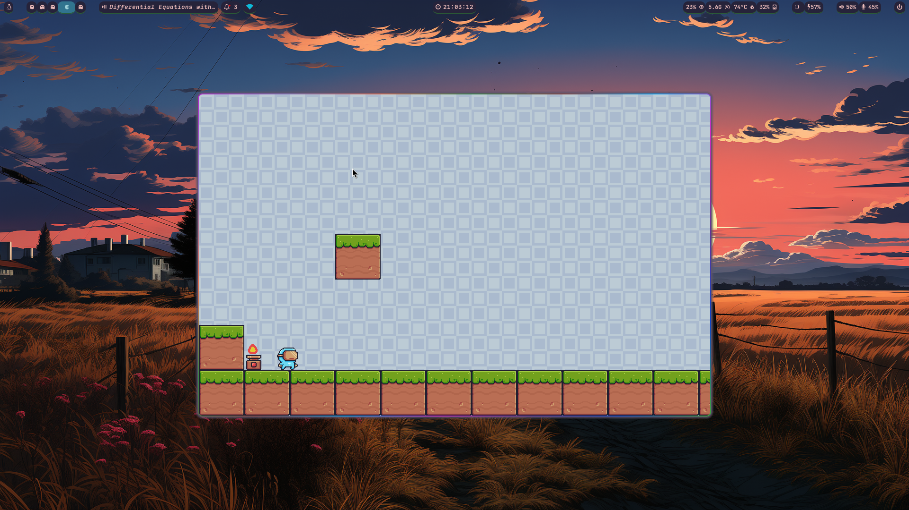

# PlatformerFunByMiskat 🎮

A feature-packed, retro-style 2D platformer adventure built with Python and Pygame!

Created by **Miskatul Anwar**, Computer Science & Engineering, University of Chittagong.



---

## 🌟 Key Features

- **4 Playable Heroes**:
  - 🕶️ **Virtual Guy**: Balanced acrobatics and smooth mobility.
  - 🐸 **Ninja Frog**: High jumps and agile leaps.
  - ⚡ **Pink Man**: Blazing fast ground speed.
  - 🛡️ **Mask Dude**: Sturdy constitution with extended invulnerability frames.
- **5 Handcrafted Adventure Levels**:
  - 🌿 **Level 1 - Greenfield Trail**: Introductory meadow with fruits, gaps, and stepping stones.
  - 🪚 **Level 2 - Sawblade Heights**: Trampolines, spinning buzzsaws, and crumbling wooden platforms.
  - 💨 **Level 3 - Windy Skies**: High-altitude platforms, falling blocks, and wind fans with air drafts.
  - 🔥 **Level 4 - Industrial Core**: Moving mechanical platforms and timing-based fire traps over spike pits.
  - 🏰 **Level 5 - The Castle Gauntlet**: The ultimate trial combining all hazards with a grand celebration banquet!
- **Interactive Hazards & Mechanics**:
  - 🍓 **8 Collectible Fruits**: Apples, Bananas, Cherries, Kiwi, Melons, Oranges, Pineapples, and Strawberries with floating bob and burst effects.
  - 📦 **Destructible Mystery Boxes**: Headbutt or stomp to reveal hidden fruits!
  - 🚀 **Trampolines**: Spring up to soaring heights.
  - 🌪️ **Wind Fans**: Continuous upward air currents that lift your character across chasms.
  - 🚩 **Checkpoints & End Trophies**: Animated flags that save respawn points, and gold trophies with confetti celebrations!
  - ⚠️ **Hazards**: Floor/wall spikes, spinning buzzsaws on patrol paths, and cycling fire traps.
  - 🧱 **One-Way & Moving Platforms**: Smooth jump-through and moving platforms that carry the player.
- **Dynamic 8-Bit Audio Engine**:
  - Procedural retro sound effects for jump, double jump, fruit pickup, trampoline bounce, impacts, checkpoint fanfare, level win, game over, and button clicks.
  - Catchy, upbeat procedural chiptune background music loop generated on-the-fly (zero external missing audio files).
  - In-game audio mute toggle (`M` key or UI button).
- **Polished UI & Progression**:
  - Title screen, Character Selection showcase, Level Selection menu.
  - Pause overlay, Level Complete screen with 3-star rating, and Game Over retry.
  - High score tracking and level unlock progress saved locally (`save_data.json`).

---

## ⌨️ Controls

| Action | Key(s) |
|---|---|
| **Move Left / Right** | `A` / `D` or `Left` / `Right` Arrow |
| **Jump / Double Jump** | `Space` / `W` / `Up` Arrow |
| **Pause Game** | `ESC` or `P` |
| **Restart Current Level** | `R` |
| **Toggle Sound / Music** | `M` |

---

## 🚀 Getting Started

### Prerequisites

- Python 3.10+
- Pygame

### Installation

```bash
# Clone the repository
git clone https://github.com/miskatul-anwar/PlatformerFunByMiskat.git
cd PlatformerFunByMiskat

# Install pygame via pip
pip install pygame
```

*Or using `uv`:*
```bash
uv venv
uv pip install pygame
```

### Run the Game

```bash
# Recommended
python main.py

# Or via package execution
python -m src.platformer

# Legacy alias (also supported)
python miskat.py
```

---

## 📁 Project Architecture & Directory Hierarchy

```
PlatformerFunByMiskat/
├── assets/                          # Pixel Adventure game art assets
│   ├── Background/                  # Parallax & seamless repeating backgrounds
│   ├── Items/                       # Collectibles (Fruits), Boxes, Checkpoints, Trophies
│   ├── MainCharacters/              # 4 Animated heroes (Virtual Guy, Ninja Frog, Pink Man, Mask Dude)
│   ├── Menu/                        # Buttons and level icons
│   ├── Other/                       # Confetti, dust particles, and effects
│   ├── Terrain/                     # Tileset sheets
│   └── Traps/                       # Saws, Spikes, Fire, Trampolines, Fans, Falling Platforms
├── src/
│   └── platformer/
│       ├── __init__.py
│       ├── __main__.py              # Package execution entry point
│       ├── config.py                # Game settings, physics constants, colors, and asset paths
│       ├── core/
│       │   ├── __init__.py
│       │   ├── game.py              # Core Game loop, state machine, and camera tracking
│       │   ├── sound.py             # Procedural 8-bit audio synthesizer (SFX & chiptune BGM)
│       │   └── storage.py           # Save file manager (high scores & star ratings)
│       ├── entities/
│       │   ├── __init__.py
│       │   ├── player.py            # Player physics, coyote time, jump buffer, health & animations
│       │   ├── terrain.py           # Solid blocks, falling platforms, and moving platforms
│       │   ├── hazards.py           # Buzzsaws, fire traps, and spikes
│       │   ├── interactables.py     # Trampolines, wind fans, checkpoints, and goal trophies
│       │   ├── items.py             # Collectible fruits and breakable mystery boxes
│       │   └── effects.py           # Confetti particles and floating score indicators
│       ├── graphics/
│       │   ├── __init__.py
│       │   └── sprites.py           # Sprite sheet slicer, animation caching, and tile loader
│       ├── levels/
│       │   ├── __init__.py
│       │   └── levels.py            # Handcrafted stage data (Levels 1 to 5)
│       └── ui/
│           ├── __init__.py
│           ├── button.py            # Interactive UI buttons with hover and click sounds
│           ├── hud.py               # Pixel health hearts, score, stage timer, and fruit counter
│           └── screens.py           # Main Menu, Character Select, Level Select, and overlays
├── main.py                          # Primary application entry point
├── miskat.py                        # Backwards-compatible legacy entry point
├── requirements.txt                 # Project dependencies
├── pyproject.toml                   # Standard packaging metadata
└── README.md                        # Documentation
```

---

## 📜 License & Credits

- Game Programming & Design: **Miskatul Anwar** (University of Chittagong)
- Art Assets: Pixel Adventure (CC0)
